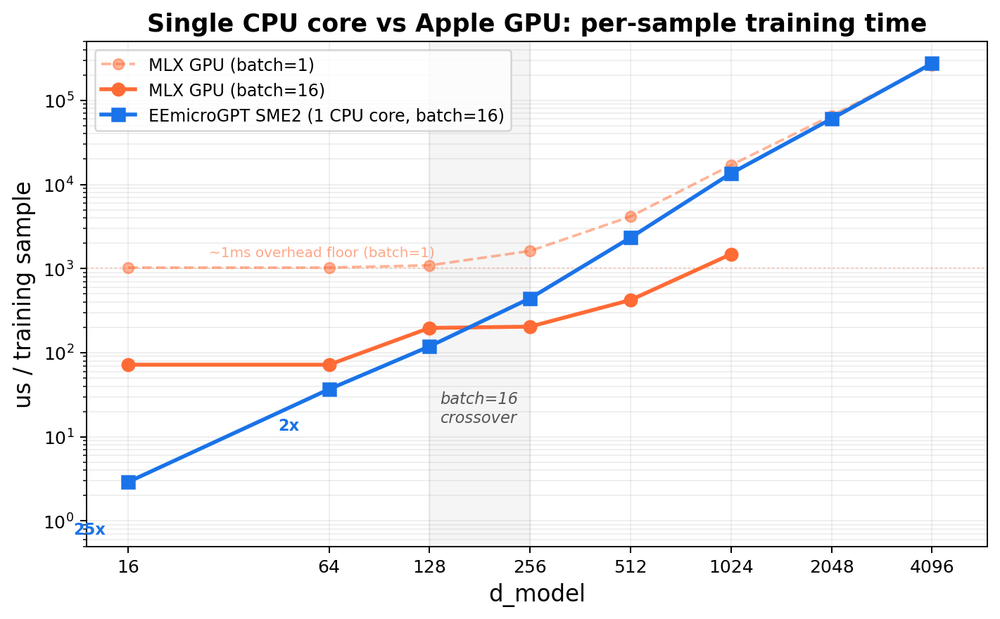
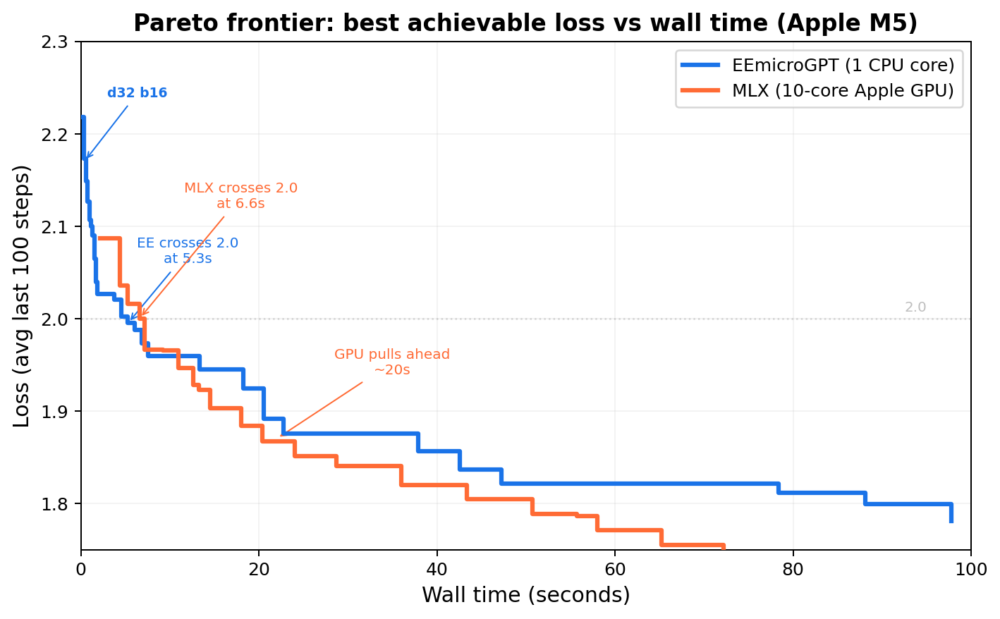

# EEmicroGPT

> *"This file is the complete algorithm. Everything else is just efficiency."*
> — Andrej Karpathy, [microgpt.py](https://karpathy.github.io/2026/02/12/microgpt/)

**This file is the everything else.**

microgpt is the spell: a tiny transformer you can hold in your head.
[eemicrogpt](https://github.com/Entrpi/eemicrogpt/blob/master/eemicrogpt.c) is the price of casting it — what happens when you take that algorithm seriously as *work*: work that must pass through caches, vector lanes, and memory buses before a single gradient can update a single weight.

There are two optimizations happening in this story:

1. **The model optimizes its weights.** Loss falls. Generated names start sounding human.
2. **We optimize the computation that makes that learning possible.** Microseconds fall. Hyperparameter sweeps become interactive. Discovery accelerates.

The AI revolution is what you get when those two optimizations reinforce each other for long enough.

I know this because I've lived it at scale. In 2023, I led [OpenOrca](https://huggingface.co/Open-Orca) — the project that reproduced and then beat Microsoft Research's Orca pipeline, producing the most capable open-weights models below 70B for most of the year. We did it on a shoestring out-of-pocket budget, against teams with orders of magnitude more compute, by understanding the full loop end to end: data curation, training dynamics, model tuning. We didn't out-spend Microsoft Research. We out-understood the pipeline.

EEmicroGPT is that same lesson, turned inside out. OpenOrca zoomed out — better data, better scheduling, better understanding of what the model actually needed to learn. EEmicroGPT zooms all the way in — past the frameworks, past the abstractions, down to the cache lines and vector lanes where computation physically happens. The thesis is the same at both scales: the teams and the tools that win aren't the ones with the most resources. They're the ones that understand what "everything else" is doing.

---

### What this is

A single-file, dependency-free C implementation of GPT training — forward pass, backward pass, Adam optimizer, and autoregressive generation — optimized from the ground up for Apple Silicon. It trains a character-level name generator on the same architecture and dataset as Karpathy's microgpt.py, producing **identical learning dynamics** up to **19,000x faster** per training sample.

### What this is not

A claim about full-scale LLM training. This is a tiny model on a single core. The GPUs-are-slow argument applies only to workloads where kernel launch overhead dominates useful compute — which is exactly where the pedagogical insight lives.

### What you'll learn

How overhead hides inside abstraction. Why "the same math" can run 19,000x faster. How cache lines, vector lanes, and matrix tiles shape what's computationally possible. And why batch size is simultaneously a learning-theory knob and a systems knob. In short: the engine room of the AI revolution.

---

## Prologue: The spell and the price

Karpathy's microgpt.py is a beautiful object. In roughly 200 lines of Python, it implements a complete GPT — attention, feedforward network, layer norms, autoregressive generation, and training via backpropagation — built on a handwritten autograd engine. Every `Value` object records its parents and its local derivative. Call `.backward()` on the loss and gradients flow through the entire computational graph.

It's the clearest possible statement of the *algorithm*. And it is, deliberately, the slowest possible way to run it.

The name EEmicroGPT stands for "Everything Else" — or "Extreme Efficiency." It's the half of the equation that microgpt.py intentionally leaves on the table. The half that determines whether training takes 8 minutes or 30 milliseconds. The half that, at industrial scale, determines whether AI runs on a laptop or demands a datacenter.

---

## Quick start

```bash
# Scalar Neon path (any Apple Silicon Mac)
clang -O3 -ffast-math -o eemicrogpt eemicrogpt.c -lm
./eemicrogpt

# SME2 path (M4/M5+, ~2x faster at d_model >= 64)
clang -O3 -mcpu=native+sme2 -ffast-math -o eemicrogpt eemicrogpt.c -lm
./eemicrogpt
```

Requires `names.txt` in the working directory (the [Karpathy names dataset](https://raw.githubusercontent.com/karpathy/makemore/master/names.txt), ~32K names).

Configurable at compile time:

```bash
# Smaller/faster model
clang -O3 -ffast-math -DD_MODEL=16 -DN_STEPS=5000 -DLR_INIT=0.008 -o eemicrogpt eemicrogpt.c -lm

# Larger model with SME2
clang -O3 -mcpu=native+sme2 -ffast-math -DD_MODEL=128 -DN_HEADS=8 -DN_STEPS=10000 -DLR_INIT=0.003 -o eemicrogpt eemicrogpt.c -lm
```

---

## Act I: The heartbeat

A single training step is the heartbeat of every neural network ever trained. Strip away the frameworks, the distributed systems, the thousand-GPU clusters, and this is what remains:

```
forward -> loss -> backward -> update weights -> repeat
```

For our 1-layer GPT, one heartbeat looks like this:

```
embed -> rms_norm -> QKV projection -> causal attention -> O projection + residual
      -> rms_norm -> FFN (expand -> ReLU -> contract) + residual
      -> LM head -> softmax -> cross-entropy loss
      -> [reverse all of that] -> Adam update
```

| Component   | Details                                    |
|-------------|--------------------------------------------|
| Layers      | 1 transformer block                        |
| d_model     | 64 (configurable: 16, 32, 64, 128)          |
| Heads       | 4 (configurable)                            |
| d_ff        | 4 * d_model                                |
| Vocab       | 27 (a-z + boundary token)                  |
| Max seq     | 16                                         |
| Norm        | RMS norm (pre-attention, pre-FFN)          |
| Activation  | ReLU                                       |
| Optimizer   | Adam (beta1=0.85, beta2=0.99)              |
| LR schedule | Linear decay to zero                       |

Both microgpt.py and eemicrogpt.c implement this identical architecture on the same dataset. Same weights, same learning dynamics, same loss curves. Nothing about the model has changed.

Every difference in performance comes from how you talk to the hardware.

---

## Act II: The villain is abstraction overhead

At d_model=16, microgpt.py's forward pass creates **52,669 autograd tape nodes**. Every addition, every multiplication, every `exp()` call instantiates a Python `Value` object — allocating memory, recording parent pointers, storing a local derivative closure. The backward pass then walks ~57,000 nodes in reverse topological order, dispatching through a branch-heavy loop that touches each node's children.

This overhead feels invisible in math-land. The equations are the same regardless of implementation. But in silicon-land, it's fatal:

- **Pointer chasing.** Each tape node is a heap-allocated Python object. Walking the graph means following pointers to random memory locations — exactly the access pattern that modern CPUs are worst at. L1 cache (3-cycle latency) can't help when every access misses.
- **Branch misprediction.** The backward dispatch loop branches on every node's operation type. At 57K nodes with mixed operations, the branch predictor is constantly wrong, costing ~15 cycles per mispredict.
- **Object allocation.** CPython allocates and garbage-collects 52K+ objects *per training sample*. The memory allocator becomes the bottleneck, not the math.

Here's what that costs at d16 (10K training samples):

| Implementation          | us/sample | Speedup |
|-------------------------|-----------|---------|
| CPython 3.14 (batch=1)  | 49,000    | 1x      |
| PyPy 7.3.17 (batch=1)   | 17,640    | 2.8x    |
| [microgpt.cpp](https://github.com/Charbel199/microgpt.cpp) (batch=1) | 270 | 181x |
| [rust-microgpt](https://github.com/mplekh/rust-microgpt) (batch=1) | 118 | 415x |
| **EEmicroGPT** (batch=16) | **3.0** | **16,333x** |

At d64 the gap widens:

| Implementation          | us/sample | Speedup |
|-------------------------|-----------|---------|
| CPython 3.14 (batch=1)  | 713,200   | 1x      |
| rust-microgpt (batch=1) | 1,620     | 440x    |
| EEmicroGPT scalar (batch=16) | 46.8 | 15,239x |
| **EEmicroGPT SME2** (batch=16) | **36.8** | **19,380x** |

Notice the rust-microgpt line. That's not Python — it's optimized Rust with `unsafe` raw pointers and zero-gradient skipping, the fastest autograd implementation of this model we could find. EEmicroGPT is still **~44x faster** at both model sizes. The speedup is remarkably consistent, which tells you the bottleneck is structural, not just a language performance gap.

PyPy's JIT eliminates some object allocation overhead — 2.8x. The C++ port eliminates Python entirely — 181x. Rust pushes the autograd approach to its limit — 415x. But EEmicroGPT is another **40x beyond the fastest autograd**. The gap isn't about language performance anymore. It's about the computational model itself.

The key insight: both approaches are O(D^2) in model dimension. Autograd doesn't change the asymptotic complexity — it pays a huge constant factor *per scalar operation* (allocation, dispatch, pointer storage), while explicit code pays the constant factor once per tight vectorized loop. Same math, radically different relationship with the machine.

---

## Act III: The reveal — graphs collapse into matrices

The autograd graph has ~57,000 nodes. The same computation, reorganized, requires **~20 explicit matrix operations**.

This isn't an approximation or a shortcut. It's the same math, seen from a different angle. Where autograd builds a directed acyclic graph of scalar operations and walks it to compute gradients, explicit code writes out the matrix-level forward and backward passes directly — the formulas you'd find in any deep learning textbook.

The reorganization does three things simultaneously:

1. **Eliminates the graph.** No allocation, no pointer chasing, no dispatch loop. The backward pass is just code — straight-line arithmetic in the order you wrote it.
2. **Exposes data parallelism.** Instead of 57K independent scalar operations, you have 20 matrix multiplies where each inner loop processes contiguous memory in a predictable pattern. This is what caches and SIMD units are designed for.
3. **Enables batching.** Autograd microgpt processes one training sample at a time (batch=1) because the graph structure changes per sample. Explicit code can batch 16 samples together, amortizing every weight load across 16 input vectors.

Think of it as the difference between 57,000 tiny receipts and 20 big ones. The math on each receipt is the same. But the filing system — the overhead of handling each receipt — is what kills you.

---

## Act IV: The hardware has opinions

Once you've collapsed the graph into matrix operations, you discover that the hardware is not a neutral executor of arithmetic. It has strong preferences about *how* you feed it work. The next 4.3x speedup (200 -> 46.8 us at d16) comes entirely from learning those preferences.

### Registers: where speed is real

ARM's register file holds 32 SIMD registers, each 128 bits wide (4 floats). Data in registers is accessed in **zero cycles** — it's just there, part of the instruction. Data in L1 cache costs 3 cycles. L2 costs ~10. Main memory costs ~100+.

The optimization: when accumulating weight gradients across all positions in a batch, keep the accumulator *in registers* for the entire position loop. At d16, the QKV weight gradient accumulators fit in 12 Neon registers — well within the 32 available. The position loop body becomes pure fused multiply-add with no stores:

```c
for (int d = 0; d < D_MODEL; d++) {
    float32x4_t aq[D_MODEL/4];  // lives in registers across all positions
    // ... load once, accumulate across ALL positions, store once
    for (int t = 0; t < slen - 1; t++) {
        float32x4_t dq = vdupq_n_f32(dQ[t][d]);
        for (int k = 0; k < D_MODEL/4; k++)
            aq[k] = vfmaq_f32(aq[k], dq, vld1q_f32(&c->norm1[b][t][k*4]));
    }
}
```

**The lesson:** Register pressure is the first constraint a performance engineer thinks about. If your hot data fits in registers, you're running at the speed of light. If it spills to L1, you've tripled your latency. If it spills to L2, you've lost an order of magnitude.

### SIMD: four floats per heartbeat

ARM Neon processes 4 floats per instruction via 128-bit vectors. The fused multiply-add `vfmaq_f32(acc, a, b)` computes `acc += a * b` for 4 floats in a single cycle. If you're doing scalar arithmetic on a Neon-capable core, you're leaving 75% of the machine dark.

Every inner loop in EEmicroGPT operates on `float32x4_t`. The core linear projection:

```c
static inline void linear(float *y, const float *W, const float *x, int out, int in) {
    for (int j = 0; j < out; j++) {
        float32x4_t acc = vdupq_n_f32(0);
        for (int i = 0; i < in; i += 4)
            acc = vfmaq_f32(acc, vld1q_f32(W + j*in + i), vld1q_f32(x + i));
        y[j] = vaddvq_f32(acc);
    }
}
```

One weight load, one input load, one FMA — three instructions doing useful work, fully pipelined. This handles all linear projections, attention scores, and gradient accumulation.

Force-inlining (`__attribute__((always_inline))`) on `rms_norm`, `softmax`, and `linear` eliminated ~2,048 function calls per step — a 15% win at d16 where each call processes only 16-27 elements. The call/return overhead was comparable to the actual work.

### The fast exp: trading precision you don't need for speed you do

Softmax calls `expf()` ~23,000 times per step. The standard library `expf` is accurate to the last representable bit (ULP). But softmax only cares about *ratios* — `exp(a) / sum(exp)` — so relative error of 1e-4 is indistinguishable in practice.

The replacement is a degree-3 minimax polynomial that splits `exp(x)` into an integer part (bit-shifted directly into the IEEE 754 exponent field) and a fractional part (cheap polynomial):

```c
static inline float32x4_t fast_expq_f32(float32x4_t x) {
    x = vmulq_f32(x, vdupq_n_f32(1.442695041f));  // x * log2(e)
    float32x4_t xf = vrndmq_f32(x);                // floor
    float32x4_t r = vsubq_f32(x, xf);               // fractional part
    // 2^floor via direct IEEE754 exponent manipulation
    int32x4_t pow2i = vshlq_n_s32(
        vaddq_s32(vcvtq_s32_f32(xf), vdupq_n_s32(127)), 23);
    // 2^frac via polynomial
    float32x4_t p = vfmaq_f32(vdupq_n_f32(0.2402265f), vdupq_n_f32(0.0558011f), r);
    p = vfmaq_f32(vdupq_n_f32(0.6931472f), p, r);
    p = vfmaq_f32(vdupq_n_f32(1.0f), p, r);
    return vmulq_f32(vreinterpretq_f32_s32(pow2i), p);
}
```

**The lesson:** Approximation theory matters at the silicon level. Every mathematical function has a precision budget — the question is whether you're spending that budget on accuracy you actually use. For softmax, ULP accuracy is waste heat. The 11% speedup from this single substitution is free performance, paid for by understanding what the math actually needs.

### Skip the zeros: not doing work that doesn't matter

Names average ~6.5 characters, but sequences are padded to 16. About 56% of all positions are padding that contributes nothing to loss or gradients. The most important optimization isn't clever code — it's recognizing when computation is unnecessary:

```c
int slen = c->seq_lens[b];           // actual length (varies per name)
for (int t = 0; t < slen; t++) { ... } // instead of MAX_SEQ
```

This single change — checking a length and looping less — delivered a **41% speedup**. More than Neon. More than fast exp. More than any clever register trick.

**The lesson:** Before you optimize *how* you compute, ask *whether* you should compute. The same principle scales up: attention masking, sparse architectures, mixture-of-experts routing — the most impactful optimizations in modern AI are often about skipping work, not doing work faster.

### Two positions, one weight load

Instead of processing positions sequentially (load weights, dot with input 0; load weights again, dot with input 1), share the weight load across two positions:

```c
static inline void linear_2(float *y0, float *y1, const float *W,
                             const float *x0, const float *x1, int out, int in) {
    for (int j = 0; j < out; j++) {
        float32x4_t a0 = vdupq_n_f32(0), a1 = vdupq_n_f32(0);
        const float *row = W + j * in;
        for (int i = 0; i < in; i += 4) {
            float32x4_t w = vld1q_f32(row + i);  // one load, used twice
            a0 = vfmaq_f32(a0, w, vld1q_f32(x0 + i));
            a1 = vfmaq_f32(a1, w, vld1q_f32(x1 + i));
        }
        y0[j] = vaddvq_f32(a0);
        y1[j] = vaddvq_f32(a1);
    }
}
```

This halves weight memory bandwidth for QKV, O projection, and FFN — a 9% speedup. The principle is the same one that makes batching powerful at every scale: amortize data movement across more useful work.

### Transposed weights for the backward pass

Backward input gradients need W^T * dOut. Computing this from row-major `W[out][in]` requires strided column access — exactly the pattern that defeats cache prefetchers. We maintain explicit transposed copies, synced after each Adam update, so the backward matvec reads contiguous rows. A 6% win from a layout change that costs nothing at runtime.

---

## Act V: The secret matrix engine

On M4/M5 Macs, Apple's Scalable Matrix Extension 2 (SME2) provides something remarkable: a 16x16 outer-product accumulator implemented directly in hardware. The `FMOPA` instruction computes a rank-1 update of a 16x16 tile — `ZA += col_vec * row_vec` — in a single instruction.

This maps perfectly to two operations that dominate training:

**Forward projections (GEMM):** Y = W * X, tiled as 16x16 output blocks:
```c
svzero_za();
for (int k = 0; k < K; k++) {
    svfloat32_t wt = svld1_f32(pred, W_T + k * M + bi);  // 16 weights
    svfloat32_t x  = svld1_f32(pred, X + k * MAX_SEQ);   // 16 positions
    svmopa_za32_f32_m(0, pred, pred, wt, x);              // ZA += outer(w, x)
}
```

**Weight gradients (outer-product sum):** dW = sum_t dOut[t] * Input[t]^T, accumulated directly in the ZA tile across all positions.

SME2 is auto-enabled for d_model >= 64, where FMOPA throughput beats the overhead of streaming mode entry/exit. At d_model < 64, the scalar Neon path wins because the SMSTART/SMSTOP transitions (~10 cycles each) dominate the tiny matrix operations.

**The lesson:** Hardware accelerators are not universally "faster." They have an operating regime — a minimum problem size below which their setup cost exceeds their throughput advantage. SME2's regime starts at ~64x64 tiles. NVIDIA's tensor cores start at ~128x128. Knowing where your problem sits relative to these thresholds is more important than knowing which accelerator is "better."

### The fused backward: entering streaming mode once

The original SME2 backward pass called `sme2_outer_sum` six times — one per weight matrix — each time entering and exiting streaming mode. That's 112 mode transitions per step, each paying ~20-40 cycles plus register save/restore plus intermediate memory traffic.

The fix: one function that enters streaming mode once, computes all six outer-product sums with inline SVE accumulation directly into the gradient arrays, transposes dQ/dK/dV, and computes the QKV input gradients — all before exiting:

| Config      | Before   | After    | Improvement |
|------------|----------|----------|-------------|
| d64 SME2   | 717 us   | 582 us   | **19%**     |
| d128 SME2  | 2,625 us | 1,855 us | **29%**     |

The d128 win is larger because it has more FMOPA tiles (8x8 vs 4x4), so the eliminated intermediate memory traffic is proportionally bigger.

### Operation-sequential forward for L1 cache reuse

At d64, the combined weight matrices (~210 KB) exceed the M5's 128 KB L1 data cache. The batch-sequential approach (all operations for sample 0, then sample 1, ...) thrashes L1 because each sample touches all weights.

The restructured approach processes all 16 batch items through each operation before moving to the next:

```
Loop 1: Embeddings + norms for all 16 items
Loop 2: QKV projections for all 16 items    (Wq, Wk, Wv stay in L1)
Loop 3: Attention for all 16 items           (no weights needed)
Loop 4: O projection for all 16 items        (Wo stays in L1)
Loop 5: FFN for all 16 items                 (Wf1, Wf2 stay in L1)
Loop 6: LM head for all 16 items             (Wlm stays in L1)
```

Each operation's weights are loaded into L1 *once* and reused across all 16 samples before eviction. A 10% win from reordering loops — no algorithmic change whatsoever.

---

## Act VI: The GPU dragon and the killer microsecond

This is the part of the story that connects a toy name-generator to the architecture of the AI revolution.

EEmicroGPT isn't just faster than Python — a single M5 P-core likely beats an NVIDIA B200 Blackwell for this workload. Not because the M5 is a better chip. Because of **ceremony**.

### The compute is trivial

Total FLOPs per training step (forward + backward + Adam), with batch=16:

| d_model | FLOPs/step | Parameters | Weight memory |
|---------|------------|------------|---------------|
| 16      | 2.3M       | 4,192      | 16 KB         |
| 32      | 8.5M       | 14,528     | 57 KB         |
| 64      | 32.5M      | 53,632     | 210 KB        |
| 128     | 127M       | 205,568    | 803 KB        |

The B200 delivers 90 TFLOPS FP32. At peak throughput, a d32 training step would take 0.094 microseconds. The M5 takes 182 microseconds.

If the B200 could sustain even 5% utilization, it would obliterate us. It can't. The problem isn't compute — it's everything around the compute.

### The killer microsecond

A training step requires ~40 distinct GPU kernel launches: 7 forward GEMMs, 6 backward input-grad GEMMs, 7 weight-grad GEMMs, plus ~20 non-GEMM kernels (embeddings, norms, attention, ReLU, residuals, softmax, loss, Adam).

Each kernel launch has overhead. Measured CUDA launch latency is ~10-20 us host-to-device; back-to-back kernel-to-kernel gaps are ~3-5 us even with CUDA graphs. This is what NVIDIA calls the "killer microsecond" problem: Blackwell can *execute* small kernels faster than the *overhead of launching them*.

| Scenario               | Kernel overhead     | Compute | Total   | vs M5 d32   |
|------------------------|---------------------|---------|---------|-------------|
| CUDA graphs (best)     | 40 * 3 us = 120 us  | ~10 us  | ~130 us | 0.7x        |
| Async launch (typical) | 40 * 10 us = 400 us | ~10 us  | ~410 us | 2.3x slower |
| PyTorch (framework)    | 40 * 15 us = 600 us | ~10 us  | ~610 us | 3.4x slower |

**When the work is smaller than the ceremony, the faster machine loses.**

### GPU utilization at these scales

Our largest GEMM (FFN expand at d128) is `[512, 128] * [128, 104]` — 53K output elements. cuBLAS tiles this into 128x128 thread blocks: `ceil(512/128) * ceil(104/128) = 4 * 1 = 4` thread blocks. The B200 has 148 SMs. Four do useful work; 144 sit idle. Under 3% utilization.

At d32, FFN expand produces one or two thread blocks on 148 SMs. Under 1.5% utilization. The GPU's 20,480 CUDA cores and 8 TB/s HBM3e bandwidth are designed for matrices where M, N, K exceed 1024. Our matrices are 100x too small.

### The cache advantage

On the M5, the entire training state lives close to the compute:

| d_model | Weights | L1 (128 KB)? | Total state | L2 (32 MB)? |
|---------|---------|--------------|-------------|-------------|
| 16      | 16 KB   | yes          | ~180 KB     | yes         |
| 32      | 57 KB   | yes          | ~630 KB     | yes         |
| 64      | 210 KB  | partial      | ~2.3 MB     | yes         |
| 128     | 803 KB  | no           | ~8.8 MB     | yes         |

The M5 L1 serves data at ~1.5 ns. The B200's L1 is ~20 ns per SM, its L2 is ~150 ns. More critically: GPU data in L2 doesn't persist across kernel boundaries. Each of the 40 kernels reloads from HBM or L2 cache. CPU data stays in cache across the entire training step because there's no kernel boundary, no context switch, no scheduler — just one thread running straight-line code.

### Energy: the hidden scorecard

| d_model | M5 time  | M5 energy | B200 time (best)  | B200 energy | M5 advantage |
|---------|----------|-----------|-------------------|-------------|--------------|
| 32      | 182 us   | 2.7 mJ    | ~130 us           | 130 mJ      | **48x**      |
| 64      | 589 us   | 8.8 mJ    | ~140 us           | 140 mJ      | **16x**      |
| 128     | 1,904 us | 29 mJ     | ~170 us           | 170 mJ      | **5.9x**     |

The B200 draws 1,000W TDP. The M5 MacBook runs this workload at ~15W. Even at d128, where the B200 wins on wall time, the M5 uses 6x less energy per step. The GPU pays 1,000W whether its 148 SMs are busy or idle.

### Measured: the crossover is real

Theory aside, here are actual numbers. EEmicroGPT (1 CPU core, SME2, batch=16) vs [MLX](https://github.com/ml-explore/mlx) (Apple's ML framework on the M5's 10-core GPU) — same machine, same model, same data:

| d_model | EEmicroGPT | MLX GPU (batch=16) | Faster   |
|---------|-----------|---------------------|----------|
| 16      | 3.0 us    | 72 us               | EE 24x   |
| 32      | 11.4 us   | 72 us               | EE 6.3x  |
| 64      | 36.8 us   | 72 us               | EE 2.0x  |
| 128     | 119 us    | 197 us              | EE 1.7x  |
| 256     | 443 us    | 204 us              | MLX 2.2x |
| 512     | 2,335 us  | 423 us              | MLX 5.5x |

The GPU has a ~1 ms overhead floor per step (Metal command buffer submission). At batch=16 this amortizes to ~72 us/sample — a floor that EE beats up to d128. The crossover happens at d256, exactly where the matrices get large enough for GPU parallelism to overcome launch overhead.

Larger batches shift the crossover down. With batch=128, MLX pulls ahead as low as d64 — the GPU's overhead floor drops to ~21 us/sample when amortized over more work:

| d_model | EE (batch=16) | MLX (batch=128) | Faster   |
|---------|---------------|-----------------|----------|
| 16      | 3.0 us        | 21 us           | EE 7x    |
| 32      | 11.4 us       | 23 us           | EE 2x    |
| 64      | 36.8 us       | 36 us           | ~tied    |
| 128     | 119 us        | 41 us           | MLX 2.9x |

### Where the GPU wins (the scope spell)



The crossover plot tells the whole story. At small d_model, EEmicroGPT on a single CPU core is 25× faster than the Apple GPU running MLX — because every GPU kernel launch costs ~1ms of ceremony regardless of how little work the kernel does. As d_model grows, the useful work inside each kernel eventually overwhelms the launch overhead, and the GPU's massive parallelism takes over. The crossover happens around d_model=256 at batch=16.

Notice the GPU's batch=1 line: a flat overhead floor at ~1ms that doesn't budge no matter how small the model gets. That floor *is* the killer microsecond problem, made visible.

GPUs are gods of throughput, not gods of small tasks with lots of ceremony. The crossover is real — it just happens at larger scales:

- **d_model >= 256** (measured) or **>= 512** (at scale): Matrices fill GPU SMs. GEMM compute dominates launch overhead.
- **Large batches (128+)**: More positions to process in parallel, amortizing overhead further.
- **Multi-layer models**: More sequential GEMMs amortize overhead, and total compute grows faster than kernel count.

This doesn't mean CPUs beat GPUs for LLM training. It means overhead dominates tiny, many-kernel workloads. Understanding where you are on that spectrum is the real skill.

---

## The optimization diary

The codebase went from a straightforward C port (200 us/step at d16) to 46.8 us/step through 15 incremental changes. Each entry follows the same form: hypothesis -> measurement -> why it worked -> what it teaches.

| Step | Change                                          | us/step | improvement |
|------|-------------------------------------------------|---------|-------------|
| 0    | Baseline C port                                 | 200     | --          |
| 1    | Force-inline rms_norm/softmax                   | 170     | 15%         |
| 2    | Neon HEAD_DIM=4 attention                       | 165     | 3%          |
| 3    | Fast Neon exp approximation                     | 147     | 11%         |
| 4    | Batched GEMM forward                            | 140     | 5%          |
| 5    | Fused backward (Phase 1+2 merge)                | 132     | 6%          |
| 6    | Neon-vectorize all backward loops               | 126     | 5%          |
| 7    | Register-accumulator GEMM                       | 123     | 2%          |
| 8    | Skip padding (fwd + bwd)                        | 81      | 34%         |
| 9    | Variable-N GEMM                                 | 72      | 11%         |
| 10   | Neon linear(), eliminate transposes             | 68.6    | 5%          |
| 11   | Dot-product backward via transposed weights     | 64.3    | 6%          |
| 12   | Fused linear_relu, Neon Adam                    | 61      | 5%          |
| 13   | `__restrict__` on hot functions                 | 55.5    | 9%          |
| 14   | 2-pos batching, fused attn, reg-accum wgrads    | 50.4    | 9%          |
| 15   | Fused attention, final tuning                    | 46.8    | 7%          |

**Total: 200 -> 46.8 us/step (4.3x)**

Notice the shape: no single optimization is a silver bullet. The 4.3x comes from 15 changes, each contributing 2-34%. This is what optimization actually looks like — a patient accumulation of understanding, not a flash of insight. The same compounding dynamic drives the AI revolution at industrial scale.

### Plot twists: what didn't work

Not every hypothesis survived measurement.

**SME2 at d_model=16: 10% regression.** The SMSTART/SMSTOP streaming mode transitions (~20-40 cycles each) dominate when matrix tiles are only 16x16. One tile per projection means the transition overhead exceeds the compute savings. *Lesson: every abstraction has an activation energy. When the work is small enough, the setup cost wins.*

**Removing zero-checks in LM head backward: regression.** The dlogits vector is 96% zeros (26/27 vocab entries per position). The zero-skip branch saves ~96% of inner loop work. Removing the branch to "simplify" the code actually deoptimized it dramatically. *Lesson: data-dependent branches can be faster than branchless code when the data is highly skewed. Profile, don't assume.*

**Fusing FFN expand + ReLU + contract in streaming mode: regression.** The ReLU and cache save between expand and contract involve a transposing scatter. Inside streaming mode, this runs as SSVE scalar code at ~3.6x the cost of Neon, outweighing the saved transitions. *Lesson: instruction set features have side effects. SME2's streaming mode disables normal Neon — if your kernel needs Neon operations mid-stream, you pay dearly.*

**Splitting fused QKV weight + input grad loop: regression from cache pressure.** The fused loop keeps dQ/dK/dV/norm1 hot in L1. Splitting into separate passes forces re-reads. *Lesson: sometimes "cleaner" code is slower code. Cache locality doesn't care about your abstractions.*

**Reducing Cache struct size: no effect.** The per-batch working set (~29 KB) already fits L1 (128 KB). Making it smaller didn't make it faster — it was already at the speed limit. *Lesson: once you're in L1, you're in L1. Further shrinking doesn't help.*

---

## Model dynamics: speed changes what you can discover

Everything above is about the second optimization — making the computation faster. But the reason speed matters is the first optimization: the model learning.

### Loss vs time is the real axis

Loss vs step is a mathematical curiosity. **Loss vs time** is what determines whether you can actually iterate — try a learning rate, see results, adjust, try again. This is the axis that matters for research, for hyperparameter search, for the practical experience of doing AI.

**bpc@1s: best quality within ~1 second of training (batch=16, M5 single P-core)**

| d_model | backend | us/step | steps/1s | loss   |
|---------|---------|---------|----------|--------|
| 16      | scalar  | 57.1    | 16,700   | 2.0869 |
| 32      | scalar  | 181     | 5,150    | **2.0747** |
| 64      | scalar  | 832     | 1,100    | 2.1384 |
| 64      | SME2    | 589     | 1,700    | 2.0974 |
| 128     | scalar  | 4,779   | 220      | 2.2633 |
| 128     | SME2    | 1,904   | 545      | 2.1645 |

**Winner: d32 scalar at LR=0.007 -> loss 2.0747**

This table tells a story about the *dynamics* of model capacity vs compute budget. d32 hits the sweet spot: enough capacity to learn well, small enough to run thousands of steps per second. At d16, the model is capacity-limited — more steps can't overcome too few parameters. At d64+, the per-step cost eats into the time budget so severely that the capacity advantage can't compensate.

This tradeoff — more capacity vs more iterations within a fixed time budget — is the central tension of all practical AI training. It's why learning rate schedules, batch size selection, and model sizing are engineering decisions as much as mathematical ones.

### Convergence reference (long runs)

| d_model | steps | LR     | loss                  |
|---------|-------|--------|-----------------------|
| 16      | 100K  | 0.006  | ~2.06 (capacity floor) |
| 32      | 500K  | 0.002  | 1.92                  |
| 64 (SME2) | 1M  | 0.0007 | 1.74 (~10 min wall)   |

Given enough time, larger models win on loss — they always do. The question is whether your *iteration loop* is fast enough to find the right hyperparameters for those larger models. EEmicroGPT makes that iteration loop interactive: sweep learning rates in seconds, not hours.

### Batch size is two knobs at once

Batch size simultaneously changes:

1. **Gradient noise** (learning dynamics): Larger batches average over more samples, producing smoother gradient estimates. This changes convergence behavior — sometimes better, sometimes worse.
2. **Hardware utilization** (systems): Larger batches amortize weight loads across more input vectors, keeping SIMD lanes and cache lines productive.

Our batch=16 choice isn't arbitrary — it's the point where these two knobs align. The 16 samples amortize weight loads effectively (SIMD utilization > 90%), while keeping gradient noise high enough for the small model to escape local minima. At batch=1 (microgpt.py), you pay full weight-load cost for every sample. At batch=256, per-sample throughput is flat but loss plateaus — you've averaged away the gradient noise without gaining convergence speed. Batch=128 is the sweet spot for this model.

This is a microcosm of how batch size selection works at every scale in AI. It's always a joint optimization over learning dynamics and hardware efficiency.

---

## Epilogue: Speed is epistemology

The point of EEmicroGPT isn't the name generator. Nobody needs a faster way to produce plausible baby names.

The point is the loop of discovery. When a training run takes 490 seconds, you try one hyperparameter combination per experiment. When it takes 30 milliseconds, you try thousands. You develop *intuition* — you start to feel how learning rate interacts with model capacity, how batch size shapes the loss landscape, how warmup schedules affect early training dynamics. Speed doesn't just make things faster. It changes what you can notice.

Here's what all of that looks like when you plot loss against wall time instead of steps:



([Full sweep with individual configurations](pareto.png))

Sweeping (d_model, batch, learning_rate) for fastest time to loss < 2.0:

| Engine         | Best config                    | Time to loss < 2.0  |
|----------------|-------------------------------|---------------------|
| **EEmicroGPT** | d32, batch=64, lr=0.007       | **5.1s**            |
| MLX GPU        | d64, batch=256, lr=0.007      | 7.2s                |

EE dominates the 0-7 second regime — the regime where you're exploring, sweeping, building intuition. MLX pulls ahead after ~20 seconds, where larger models have time to converge. Both frontiers are real; the question is which regime you're operating in.

At EE's speed, a 100-configuration hyperparameter sweep finishes in under 10 minutes. The difference between an interactive experience and an overnight batch job. The difference between developing intuition and waiting for results.

This is, in miniature, exactly how the AI revolution happened. Not one breakthrough, but a compounding feedback loop: faster hardware enabled more experiments, which produced better understanding of training dynamics, which informed better hardware design, which enabled more experiments. The substrate of the revolution isn't any single algorithm or chip — it's the *iteration speed* of the entire loop.

EEmicroGPT is a guided tour of that loop's engine room. From loss curves down to FMOPA tiles, from Adam's momentum terms to L1 cache residency, from the model optimizing its weights to us optimizing the computation that makes learning possible — the two optimizations, rhyming all the way down.

Two minutes of training at d64 reaches 1.77 loss — generating names like *Karina*, *Jaylen*, *Aria*.

---

## Try it yourself

Three micro-experiments, each runnable in 60 seconds, each teaching one big idea.

**1. Toggle padding skip** (the cost of useless work)

In `eemicrogpt.c`, find the padding-skip loops (`for (int t = 0; t < slen; t++)`) and change them to `for (int t = 0; t < MAX_SEQ; t++)`. Recompile and time. You'll see a ~40% regression — the cost of computing gradients for positions that contain no information. The same principle drives sparse attention, mixture-of-experts routing, and every "skip the irrelevant work" optimization in modern AI.

**2. Toggle fast exp vs expf** (precision budgets)

Replace calls to `fast_expq_f32` with the standard `vexpq_f32` or scalar `expf`. Measure the wall time difference. Then compare the loss curves — they'll be nearly identical. The 11% speedup is free because softmax's precision requirements are much lower than `expf` provides.

**3. Change batch size and watch the crossover** (dynamics meets hardware)

Recompile with `-DBATCH=1` and then `-DBATCH=32`. At batch=1, you'll see per-sample cost skyrocket (weight loads not amortized). At batch=32, per-sample cost drops but total step time rises. Somewhere in between is the sweet spot — and finding it teaches you that batch size isn't just a learning hyperparameter, it's a systems parameter.

---

## File structure

It's [one file](https://github.com/Entrpi/eemicrogpt/blob/master/eemicrogpt.c). That's the point.

```
eemicrogpt.c    — everything
names.txt       — training data (32K names, from Karpathy's makemore)
```

## License

MIT